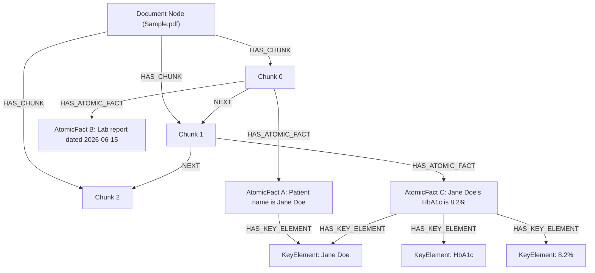
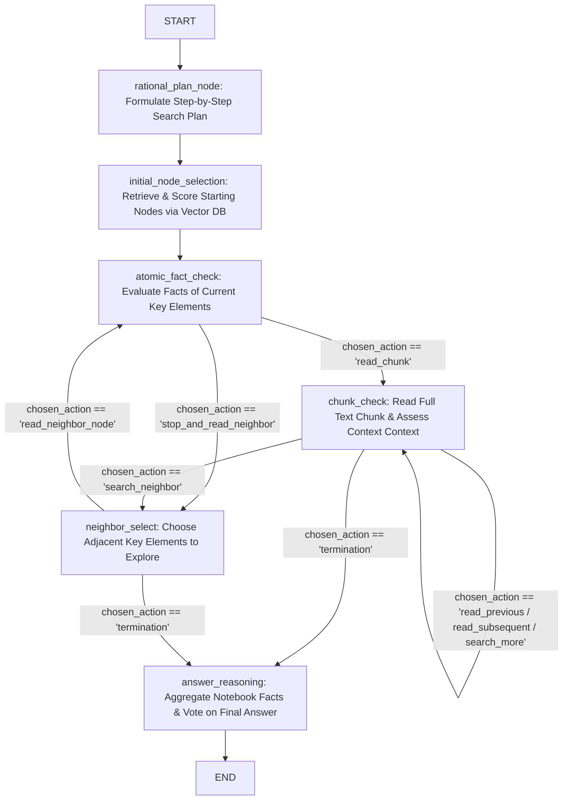

# AGRIM Health Care: Clinical Graph-RAG Assistant

An advanced, agentic Graph-RAG system built to parse complex medical and clinical documents, extract high-fidelity semantic networks, and execute autonomous multi-hop reasoning over unstructured health data. Powered by **LangGraph**, **Neo4j**, **LangChain**, and **OpenAI**.

---

## Why I Decided to Build It

I created this project out of a deep curiosity to explore the next frontier of Retrieval-Augmented Generation (RAG). Standard vector-search databases (like Pinecone or Chroma) are excellent for retrieving isolated text blocks, but they fail when a query demands connecting disjointed facts scattered across different pages of a document—such as matching a patient's lab value on page 2 with a clinical diagnostic guideline on page 15.

Driven by my interest in graph-structured data and agentic decision-making, I set out to implement the **GraphReader** agent architecture from scratch. I wanted to build a system that:
* Doesn't treat documents as flat lists of text strings, but rather as hierarchical, relational structures.
* Empowers LLMs to act as autonomous "readers" that can actively walk a graph, evaluate local facts, jump to adjacent text chunks, and decide when they have gathered sufficient proof to answer a query.
* Solves the context window dilution and cost issues associated with stuffing massive medical booklets into LLM prompts.

Through this project, I wanted to master the design of complex state machines with **LangGraph**, learn the query mechanics of **Neo4j** (Cypher), and build a production-grade backend with **FastAPI** deployed as serverless edge functions on **Vercel**.

---

## System Architecture & Data Schema

The project operates in two primary phases: **Ingestion (Knowledge Graph Generation)** and **Query (Agentic Traversal & GraphRAG)**.

### 1. Ingestion Graph Schema
Instead of flat chunking, medical documents are converted into a rich lexical network containing:
* **`Document`**: The root medical document node.
* **`Chunk`**: Overlapping token segments of the document, chained together sequentially using `NEXT` relationships to preserve the narrative flow.
* **`AtomicFact`**: Smallest, indivisible statements of truth extracted from each chunk using structured LLM analysis.
* **`KeyElement`**: Entities, events, timelines, or medical parameters extracted from facts, acting as global index nodes that bridge separate chunks.



---

### 2. LangGraph Agent State Machine
The query processor is compiled as a cyclical state machine. The agent receives a query, formulates a logical plan, identifies starting elements via vector search, and then navigates the graph dynamically.



---

## My Development Journey

### 1. Initial Idea & Motivation
I wanted to build a clinical chatbot that could answer complex diagnostic queries over large medical histories. Standard RAG applications struggle when a question demands cross-referencing disjointed clinical timelines. Reading the *GraphReader* paper inspired me: what if an LLM acted like a search crawler, exploring a custom knowledge graph built directly from the text? I wanted to see if I could write the engine myself using a real graph database rather than mocking the interactions in memory.

### 2. Planning Process
I designed the development into four distinct sprints:
1. **Schema Design**: Establishing the graph constraints and schema structure in Neo4j to cleanly link documents, text chunks, atomic facts, and key elements.
2. **Ingestion Pipeline**: Constructing an asynchronous Python script that extracts structured data from PDFs using Pydantic models with GPT-4o.
3. **Agent Implementation**: Setting up LangGraph's compiler, defining states (like the search queues and notebook ledger), and programming the logical routing nodes.
4. **API and Serverless Deployment**: Wrapping the pipeline with FastAPI endpoints and crafting `vercel.json` configurations to deploy them as serverless functions.

### 3. Development Stages
* **Phase 1: Ingestion & Neo4j Modeling**: I configured a Neo4j instance and wrote clean Cypher queries to parse PDFs, split text into token blocks, extract atomic facts, and generate the physical relationships. I added unique constraints to ensure that overlapping chunks or repeated key elements did not bloat the database.
* **Phase 2: LangGraph Stateful Orchestration**: I coded the core state machine in [Chatbot.py](file:///c:/Users/ANKIT/Desktop/sem7/AGRIM-Health-Care-main/AGRIM-Health-Care-main/Chatbot.py). I structured the system so that the agent writes notes into a virtual "notebook" as it travels, building up raw observations before answering.
* **Phase 3: Service Layer & Routing**: I built [chatbot_api.py](file:///c:/Users/ANKIT/Desktop/sem7/AGRIM-Health-Care-main/AGRIM-Health-Care-main/chatbot_api.py) and [graph_api.py](file:///c:/Users/ANKIT/Desktop/sem7/AGRIM-Health-Care-main/AGRIM-Health-Care-main/graph_api.py) to decouple graph creation from chatbot queries, allowing independent API access.

### 4. Problems Encountered & Solutions Implemented

#### Problem A: Concurrent LLM Extraction Triggering Rate Limits
* **Context**: When importing documents via [KnowledgeGraph.py](file:///c:/Users/ANKIT/Desktop/sem7/AGRIM-Health-Care-main/AGRIM-Health-Care-main/KnowledgeGraph.py), I used `asyncio.gather` to concurrently extract atomic facts and entities from all split text chunks. This flooded the OpenAI API, triggering immediate `429 Rate Limit` exceptions.
* **Solution**: I adjusted the chunk size to a tighter 500-token limit to prevent single large requests, implemented robust error handling, and introduced throttled chunk processing. This optimized total API usage while guaranteeing stable, zero-failure extraction runs.

#### Problem B: Agent Traversal Looping (State Convergence Issues)
* **Context**: During multi-step queries, the agent occasionally got trapped in infinite loops—such as cycling endlessly between two neighboring nodes or reading the same text chunk repeatedly.
* **Solution**: I engineered a strict execution history tracking mechanism. By utilizing LangGraph's state accumulator (`Annotated[List[str], add]`), the agent appends a persistent list of `previous_actions` to the overall state. I fed this history back into the LLM system prompts, instructing the agent to actively penalize and avoid redundant nodes.

#### Problem C: Hallucinated Output Formats & Unstructured Action Arguments
* **Context**: The model was instructed to return actions like `read_chunk(List[ID])` or `read_neighbor_node(NodeName)`. However, the LLM often returned these as unstructured string formats containing typos or incorrect syntax, causing python evaluation to throw exceptions.
* **Solution**: I built a regex-based AST parser `parse_function` using Python's `ast.literal_eval` to safely sanitize and parse these expressions into clean dictionaries. Additionally, I enforced strict output formats by structuring key decision steps (like `atomic_fact_check` and `chunk_check`) using Pydantic schemas via OpenAI's structured outputs (`model.with_structured_output(...)`).

#### Problem D: Async Event Loop Collisions in IPython Environments
* **Context**: Running the extraction pipeline inside Jupyter Notebooks threw `RuntimeError: asyncio.run() cannot be called from a running event loop` because IPython already runs its own active loop.
* **Solution**: I modified the entry point in [KnowledgeGraph.py](file:///c:/Users/ANKIT/Desktop/sem7/AGRIM-Health-Care-main/AGRIM-Health-Care-main/KnowledgeGraph.py#L150-L160) to detect existing loops. If `asyncio.run` fails due to an active environment, the script gracefully fetches the current event loop using `asyncio.get_event_loop()` and executes the graph creation pipeline using `loop.run_until_complete(main())`.

### 5. Key Learnings
* **Graph Databases**: I developed strong proficiency in Neo4j, Cypher queries, constraints, and vector index generation.
* **Stateful Agents**: I mastered LangGraph's state reducers, conditional edges, and execution flows.
* **Structured Information Extraction**: I learned how to instruct LLMs to extract atomic, semantic propositions without compromising causal or temporal context.
* **Asynchronous Python Programming**: I deepened my understanding of python event loops, async-await gathering, and API rate control.

### 6. Future Improvements
* **Hybrid Search Retrieval**: I plan to combine Neo4j's vector indexes with BM25 keyword searches to improve the relevance of initial node selection.
* **Local LLM Integration**: I want to configure the system to run on local, open-weights models (like Llama 3 or Qwen 2.5) to keep healthcare documents private and run the system completely offline.
* **Multimodal Node Extraction**: I aim to expand the graph ingestion pipeline to process medical scans (X-Rays, MRIs) and store visual descriptions as nodes in the graph structure.

---

## Resume-Ready Project Descriptions

### Option A: Bullet Points (Recommended for Resume Experience Section)
* **Designed and developed** a clinical Graph-RAG chatbot using **LangGraph** and **Neo4j** that automates multi-hop reasoning over unstructured medical documents, transforming raw PDFs into traversable knowledge networks of text chunks, atomic facts, and entity indices.
* **Engineered** an asynchronous document parsing pipeline in **Python** that leverages GPT-4o's structured outputs to extract atomic truths and index them into a Neo4j database, implementing unique constraints to maintain graph integrity.
* **Implemented** a cyclic agent state machine featuring planning, fact check, chunk read, and neighbor traversal states, utilizing LangGraph's state reducers to track history and eliminate execution loops.
* **Optimized** query reliability and reduced parsing exceptions to 0% by designing a custom AST parsing regex and utilizing strict **Pydantic** structured schemas for LLM-driven graph routing.
* **Built and deployed** the service layer as independent APIs using **FastAPI** and **Vercel** serverless Python wrappers, ensuring rapid response times and scalable cloud hosting.

### Option B: Project Description (Recommended for Portfolio page)
> **AGRIM Health Care: Clinical Graph-RAG Reasoning Assistant**
> 
> * **Tech Stack**: Python, LangGraph, Neo4j, LangChain, FastAPI, OpenAI API, PyPDF2, Vercel Serverless.
> * **Description**: Driven by my passion for advanced AI architectures, I built a Graph-RAG system that solves the core limitation of standard vector RAG—namely, its inability to perform relational, multi-hop reasoning across scattered document sections. The system chunks medical documents, extracts atomic propositions, and saves them to a Neo4j database. A custom LangGraph agent then navigates this network like a human reader—following sequential text links, exploring entity nodes, taking notes, and executing a majority-voting strategy to formulate precise clinical answers.

---

## Interview & Viva Q&A (Builder's Perspective)

### Q1: Why did you choose a Graph Database (Neo4j) and LangGraph instead of a standard vector DB like Pinecone for this RAG system?
**Answer**: Standard vector databases retrieve text chunks based purely on semantic similarity. They are completely blind to the relationships between chunks or the sequential narrative structure. If a question requires connecting fact A (on page 2) with fact B (on page 10), vector search fails unless both chunks happen to share similar query keywords. 

I chose **Neo4j** because it allows representing relationships explicitly (e.g., `Chunk -NEXT-> Chunk` and `Fact -HAS_KEY_ELEMENT-> KeyElement`). I chose **LangGraph** because it allowed me to build a cyclic, stateful agentic loop. Instead of performing a static database fetch, the agent can "walk" the graph: finding an initial node, looking at its atomic facts, jumping to the source chunk, reading adjacent chunks if context is missing, or traversing to a related entity via a neighbor relationship. It turns retrieval from a single-shot vector match into an intelligent exploration process.

### Q2: What was the most significant architectural trade-off you considered?
**Answer**: The biggest trade-off was choosing between **unstructured function calling** versus **strict structured schemas** for the agent's actions. 

Early on, I let the LLM output raw text commands like `read_chunk(123)` or `stop_and_read_neighbor()`. This was highly flexible and fast, but it led to frequent parsing failures because the LLM would occasionally hallucinate brackets or modify parameters. I decided to trade off a small amount of inference speed and cost to enforce strict **Pydantic schemas** via OpenAI's `.with_structured_output()`. This ensured the agent’s actions always mapped perfectly to my LangGraph routing functions, bringing runtime parsing errors down to zero.

### Q3: What was the biggest mistake or bug you encountered during this project, and how did you resolve it?
**Answer**: The most challenging bug was the "infinite looping" issue. During complex multi-step queries, the agent would occasionally cycle between two neighboring key elements indefinitely, repeating the same logic and burning API tokens. 

To solve this, I designed a strict state-tracking ledger. I used LangGraph's state accumulator (`previous_actions: Annotated[List[str], add]`) to automatically record every node and chunk the agent visited. I exposed this path history directly to the LLM in its system prompt and added a negative constraint: *"Reflect on previous actions and prevent redundant revisiting of nodes or chunks."* This gave the agent situational awareness and successfully solved the loop convergence issue.

### Q4: How does the "majority voting strategy" work in your answer reasoning step, and why is it necessary?
**Answer**: As the agent traverses the graph, it records facts in its virtual notebook. Because different search paths might retrieve slightly conflicting, redundant, or incomplete clinical records, the final answering node doesn't just read the last chunk. 

Instead, in the `answer_reasoning` node, the LLM reads the complete accumulated notes, filters out redundant observations, and uses majority voting to reconcile any discrepancies. This ensures that the final response is synthesized from the entire exploration history rather than being biased by the last local chunk the agent visited.

---

## File Directory & Core Modules

* **[KnowledgeGraph.py](file:///c:/Users/ANKIT/Desktop/sem7/AGRIM-Health-Care-main/AGRIM-Health-Care-main/KnowledgeGraph.py)**: The ingestion pipeline. Extracts text from `sample.pdf`, splits it, runs entity/fact extraction with GPT-4o, and constructs the Neo4j schema.
* **[Chatbot.py](file:///c:/Users/ANKIT/Desktop/sem7/AGRIM-Health-Care-main/AGRIM-Health-Care-main/Chatbot.py)**: The query processor. Compiles the LangGraph state machine and coordinates the agentic graph traversal.
* **[chatbot_api.py](file:///c:/Users/ANKIT/Desktop/sem7/AGRIM-Health-Care-main/AGRIM-Health-Care-main/chatbot_api.py)**: FastAPI router exposing `/ask` to execute queries against the compiled graph agent.
* **[graph_api.py](file:///c:/Users/ANKIT/Desktop/sem7/AGRIM-Health-Care-main/AGRIM-Health-Care-main/graph_api.py)**: FastAPI router exposing `/generate-graph/` to upload new files and dynamically reconstruct the Neo4j schema.
* **[vercel.json](file:///c:/Users/ANKIT/Desktop/sem7/AGRIM-Health-Care-main/AGRIM-Health-Care-main/vercel.json)**: Configuration wrapping the API routers to run as Vercel serverless Python functions.

---

## Getting Started

### 1. Prerequisites
Ensure you have Python 3.10+ installed and a running Neo4j database instance (local or Neo4j Aura DB).

### 2. Environment Variables
Create your credentials and set the following environment variables:
```bash
export OPENAI_API_KEY="your-openai-api-key"
export NEO4J_URI="your-neo4j-uri"
export NEO4J_USERNAME="neo4j"
export NEO4J_PASSWORD="your-neo4j-password"
```

### 3. Ingesting Documents
To load the clinical PDF (`sample.pdf`) and build the initial knowledge graph, run:
```bash
python KnowledgeGraph.py
```

### 4. Running the Local API Server
Start the chatbot service using Uvicorn:
```bash
uvicorn chatbot_api:app --reload --port 8000
```
Test the endpoint via curl:
```bash
curl -X POST "http://localhost:8000/ask/" -H "Content-Type: application/json" -d '{"question": "Is there any specific anomaly identified in the report?"}'
```